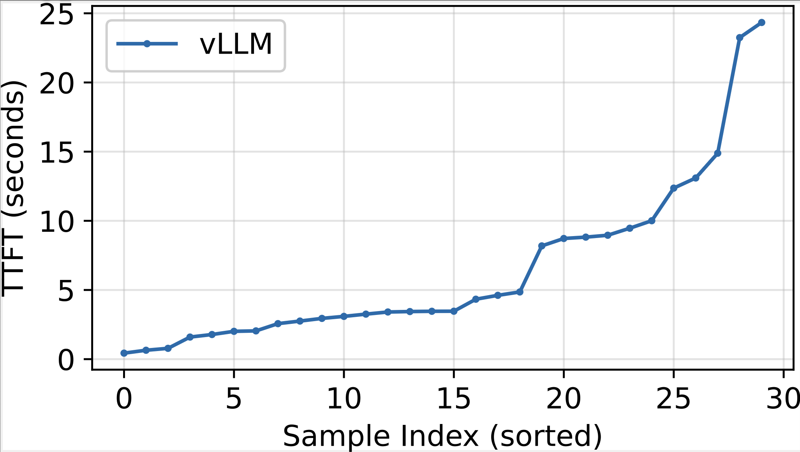

# CS5470 - HW2: Scheduling prompts
**Due: 10/8/2025 11:59pm**

## 1 Overview

This homework focuses on resource scheduling for LLM serving on GPUs with limited memory. You will setup a 34B model on 2 A100 GPUs and measure how much memory the weights occupy and how much memory remains for the KV cache.

The first step is to benchmark and plot how a burst of requests affects the perceived responsiveness of the LLM for each prompt's user. After this, you will implement a series of changes to vLLM's built-in scheduler class to improve responsiveness of the system.

You might find the `Scheduling` section in this [blog](2https://medium.com/@crclq2018/explaining-the-source-code-behind-the-vllm-fast-inference-engine-91429f54d1f7) helpful.

## 2 Prerequisites
We will install all the required packages under `/pscratch` for faster compilation, including the vLLM codebase and Conda environment. We suggest you use VSCode SSH extension to work on Perlmutter.

### Apply for model access
Apply for model access on Huggingface
https://huggingface.co/codellama/CodeLlama-34b-hf

### Create Conda Environment
```bash
module load conda
conda create --prefix $PSCRATCH/sysml2 python=3.10.12
```

### Activate Conda Environment
```bash
conda activate $PSCRATCH/sysml2
conda install gxx_linux-64
```

### Clone VLLM Repository
```bash
cd $PSCRATCH
git clone https://github.com/vllm-project/vllm.git
cd vllm
git reset --hard 5fbbfe9a4c13094ad72ed3d6b4ef208a7ddc0fd7
# We are using v0 version 
```

### Install PyTorch
```bash
python3 -m pip install torch==2.5.0 torchvision==0.20.0 torchaudio==2.5.0 --index-url https://download.pytorch.org/whl/cu124 -v
```

### Build vLLM
```bash
python3 use_existing_torch.py
export CMAKE_VERBOSE_MAKEFILE=1
pip install setuptools-scm wheel build setuptools
conda install -c conda-forge cmake

```

```bash
salloc ... # get a GPU node and work from there

module load conda
conda activate $PSCRATCH/sysml2
cd $PSCRATCH/vllm
# this step will take roughly 20 minutes
MAX_JOBS=32 python3 -m pip install -e . --no-build-isolation -v 
pip install "transformers<4.54.0" 
```

<!-- **Step 1: Setup vLLM**
Homework 1 provides instructions to setup vLLM, this step is necessary to proceed with the current Homework.

**Step 2: Homework Files**
Copy the homework zip file into the vLLM source's root directory and uncompress it. This should create a new directory called assignment 1. -->

### Install CodeLLama-34b
```
hf auth login
export HF_HOME=$PSCRATCH/huggingface
huggingface-cli download meta-llama/CodeLlama-34b-hf
```

## 3 Homework Tasks

This homework is designed to understand how serving engines schedule prompts on the GPU and how to make serving more responsive.

### 3.1 Understanding why the TTFTs are high

Within the homework folder, we have provided `server.sh`, a script that starts a vLLM instance running `codeLlama-34B` on GPU 0 and 1 of the server and exposes an OpenAI compatible HTTP server.

**Task 1: Generating a burst of requests**

(a) Start the codeLlama-34B model on 2 GPUs using the command provided in server.sh. Note that we store the server log in `vllm_server.log`

(b) Execute the benchmark script using the command in `client.sh`. This file creates a burst of 30 requests in a short duration.

(c) Store the TTFT (Time To First Token) and TPOT (Time Per Output Token) of each prompt from the output and plot the TTFT and TPOT over prompt index in the **issuing order** (you don't need to sort the output here, unlike hw1).  Notice how the TTFTs of requests later in the queue have higher TTFTs.

(d) Plot the GPU KV cache usage over time using the server log. 


Plot the TTFTs, you should see a graph like below (Figure 3.1) (you will have 50 prompts along x-axis, and the plot might not be strictly increasing).


**Task 2: Answer the following MCQs**

1. What is the default scheduling policy of vLLM?
   (Hint: Look at $PSCRATCH/vllm/core/scheduler.py, use the version there)
   
   (a) LCFS (Last Come First Serve)
   
   (b) SJF (Shortest Job First)
   
   (c) FCFS (First Come First Serve)
   
   (d) LJF (Longest Job First)

2. What is preventing vLLM from batching all the incoming prompts on the GPU?
   
   (a) GPU compute capacity
   
   (b) GPU memory bandwidth
   
   (c) GPU power supply
   
   (d) GPU memory capacity

### 3.2 Reducing the TTFT variance during bursts

You will now introduce changes to vLLM's scheduler to implement preemptive scheduling. This scheduling policy mimics Linux's Completely Fair Scheduler which relies on preemption. Existing policy admits a certain number of prompts on the GPU, waits for them to complete generating all the tokens and then admits the next batch of prompts. In preemptive scheduling, the policy admits a certain number of prompts, generates a fixed number of tokens for each prompt, preempts the prompts to CPU memory and then loads and executes the prompts waiting in the CPU memory on GPU memory. The policy repeats this in a loop so that all the prompts experience fair progress.

**Primer on vLLM's scheduler:**

vLLM implements a scheduler which admits new prompts into the GPU only when there is spare memory capacity. The main entry point to vLLM's scheduler is the function `_schedule` in `scheduler.py` file which calls the `schedule_default` function which implements the default policy. In this assignment, we will add another function `schedule_cfs` and change the scheduler's policy to a preemptive policy. The goal of the preemptive scheduler is to preempt lower priority prompts to execute prompts with a higher priority -- the `_get_priority` function implements how the priority is calculated for each prompt. 

vLLM also has a function called `schedule_priority_preemption` which schedules prompts with higher priority by preempting prompts on the GPU with a lower priority, the default behavior of the function is to preempt the prompts back to the waiting queue and recompute it from the prefill stage again later. 

To implement fair scheduling, we need to (1) update the `_get_priority` function, and (2) trigger preemption based on priority at a resonable frequency, and (3) not cause too much KV cache re-computation overhead after preemption (the default `schedule_priority_preemption` will). For the latter, you are going to make edits to   `schedule_priority_preemption`, scheduling the right set of prompts across the waiting prompts (newly arrived), swapped prompts and currently running prompts on the GPU.

Note that `schedule_running` will also generate preempted sequences, but that is triggered by not having enought budget for current running sequences (the KV cache keeps growing for the running sequences). We don't need to care about it.

For the following tasks, edit the `scheduler.py` file and copy-paste it to vLLM codebase.

**Task 1: Update the scheduler function of vLLM**


Find the `def _schedule(self) -> SchedulerOutputs` function and update the code to below.

```python
Scheduler.num_iters += 1
if Scheduler.num_iters == 100:
    Scheduler.num_iters = 0
if Scheduler.num_iters % 10 == 0:
    return self._schedule_cfs()
return self._schedule_default()
```

**Task 2: Implementing CFS scheduler**

The next task is to implement the CFS scheduler. You can follow the following steps to implement CFS scheduler in vLLM.

1. Change the second value in the tuple returned by `_get_priority` function to the number of tokens generated. (Lower the number, higher the priority).

2. Implement `schedule_cfs`. You can start the implementation of `schedule_cfs` by copying the contents of `schedule_default`.

3. Perform `self._schedule_priority_preemption(budget)` before `self._schedule_prefills` in `schedule_cfs`. Also remove the If statement.

4. Implement `self._schedule_priority_preemption(budget)` by adding swapping logic in the `else` block. Remember to append the victim sequence to swapped queue instead of waiting queue.

5. Copy-paste the scheduler.py file to the vLLM directory located in `$PSCRATCH`. You don't need to recompile again because the build is editable.

6. Run the client benchmark again. Make a plot containing TTFT with CFS scheduling and with default scheduling. The TTFT with CFS scheduling should be lower than the TTFT with default scheduling across most of the prompts.


If implemented correctly, the TTFTs should reduce and you should be able to produce a plot like Figure 3.2.

The TPOT will become worse, which is expected due to our scheduling policy.

**Note that there could be many ways to implement fair scheduling. You don't have to follow our guidelines. 40 points (full points) if the P99 TTFT is lower than 8000ms. 10 points will be deducted for each second exceeding 8000ms for P99 TTFT.**


**Task 3: Answer the following MCQs**

1. How does preemptive scheduling (CFS) reduce TTFT of all the prompts?
   
   (a) By prioritizing existing prompts over new prompts.
   
   (b) By prioritizing prompts with the least number of tokens.
   
   (c) No prioritization is involved.
   
   (d) By skipping some tokens.

2. What does preemptive scheduler store and load while swapping prompts between CPU DRAM and GPU?
   
   (a) KV cache of the prompts.
   
   (b) The current layer weights.
   
   (c) LoRA adapters.
   
   (d) Layer activations.

3. What is the main tradeoff of preemptive scheduling?
   
   (a) Preemption changes the accuracy of output.
   
   (b) The GPU is idle while it waits for swapping.
   
   (c) Caching optimization of KV cache vanishes.
   
   (d) Some prompts never get scheduled.

## 4 Deliverables

### Submission Requirements

Submit the following:

1. **Report (PDF format) containing:**
   - All requested plots like Figure 3.1, 3.2. [40%]
   - Answer to the MCQs using the format – section, MCQ #, answer. [10%]

2. **Code including:**
   - scheduler.py file with the CFS scheduler and client benchmark result. If you modify the vLLM server script, attach it as well. We will execute your server script. [40%]
      - 40 points (full points) if the P99 TTFT is lower than 8000ms.
      - 10 points will be deducted for each second exceeding 8000ms for P99 TTFT.

3. **Data files with benchmark results** [10%]